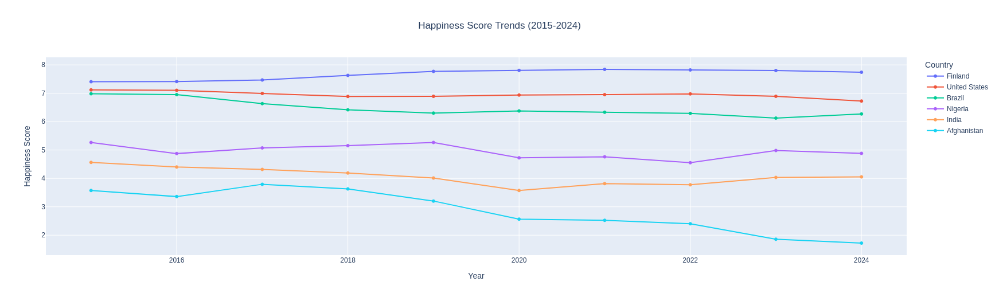
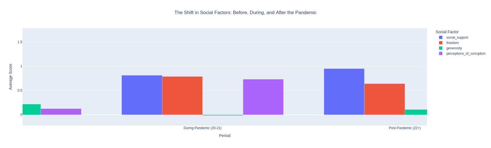
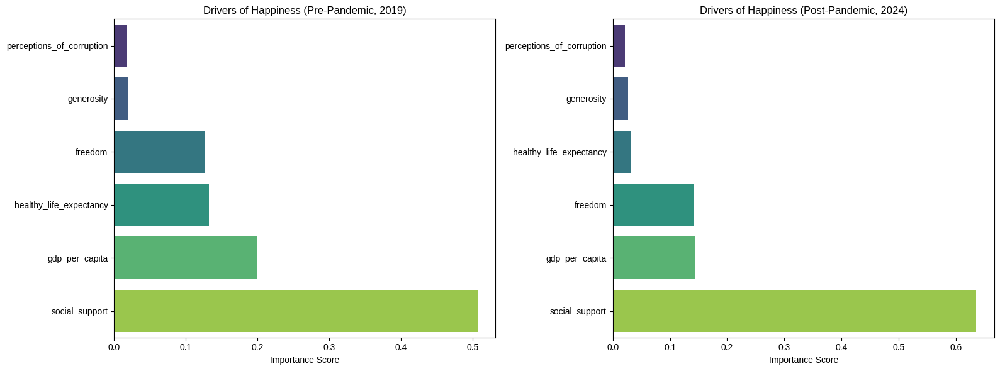

# World-Happiness-Report-Analysis(2015-2024)

This project analyzes a decade of data from the World Happiness Report to identify long-term trends and uncover the core drivers of well-being, with a special focus on the impact of the COVID-19 pandemic.

## Key Findings

1.  **Divergent Global Paths:** The analysis revealed that nations followed drastically different happiness trajectories over the decade. While countries like Finland showed remarkable stability, others like the United States saw a gradual decline, and nations like India experienced a "V-shaped" recovery.

    

2.  **The Pandemic's Impact:** The data shows a significant shift in social metrics during and after the pandemic. Global generosity and social support rose during the crisis, while perceived freedom declined in the recovery period.

    

3.  **A Shift in Values:** A machine learning model comparison between the pre-pandemic (2019) and post-pandemic (2024) eras confirmed the project's central hypothesis: the importance of **Social Support** as a predictor of happiness increased significantly, while the importance of **GDP per capita** declined.

    

## How to Run This Project

1.  Clone this repository:
    ```bash
    git clone https://github.com/Tejas-hue/World-Happiness-Report-Analysis.git
    ```
2.  Install the required libraries:
    ```bash
    pip install -r requirements.txt
    ```
3.  Open and run the `World_Happiness_Analysis.ipynb` notebook in Jupyter or Google Colab.

## Data Source

The data used in this project is from the World Happiness Report, sourced from Kaggle. [Link to Kaggle Dataset]
